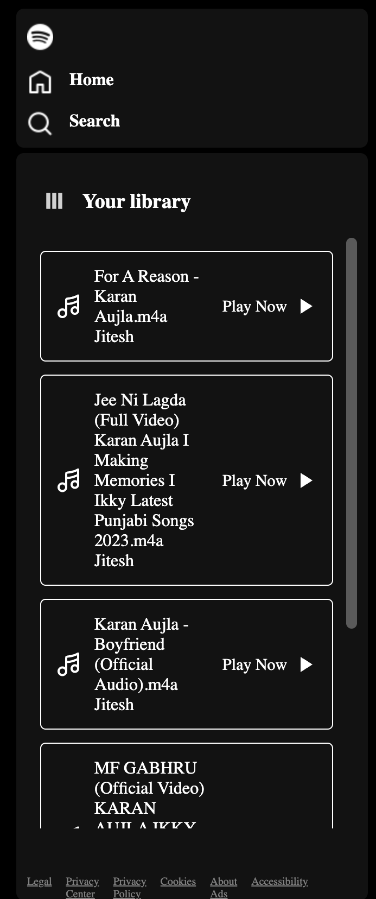
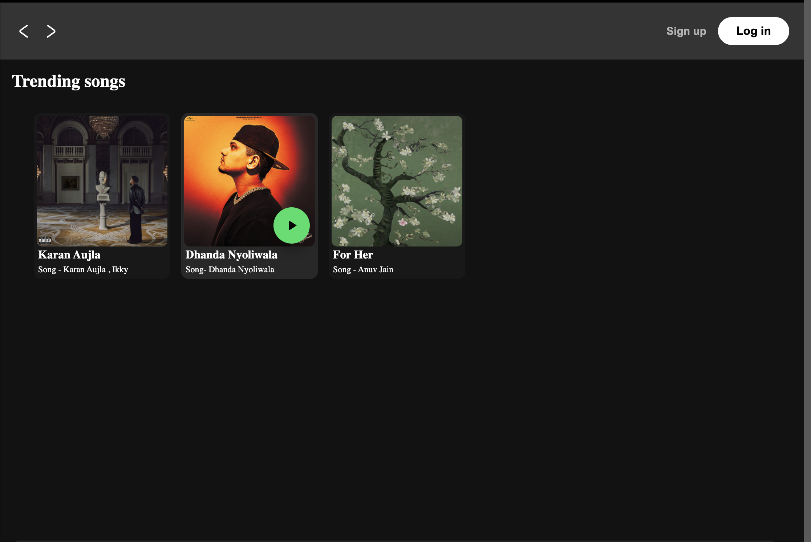

🎵 Spotify Clone

A responsive Spotify-inspired music player built using HTML, CSS, and JavaScript. This project recreates the look and feel of Spotify while implementing interactive music playback features using vanilla JavaScript.

🚀 Features

* 🎵 Play and pause songs
* ⏮️ Previous and next track controls
* 📂 Dynamic playlist loading
* 📱 Responsive design
* 🎨 Spotify-inspired user interface
* ⚡ Smooth animations

🛠️ Technologies Used

* HTML5
* CSS3
* JavaScript (ES6)

📂 Project Structure

spotify-clone/
index.html
style.css
script.js
img/
songs/
README.md
## 📸 Screenshots

### Home Page

### Playlist

### Music Player

🚀 How to Run

1. Clone the repository:

git clone https://github.com/JiteshYadav1533/Spotify-clone.git

2. Open the project folder.
3. Open index.html in your browser or run it using the VS Code Live Server extension.

📚 What I Learned

* DOM Manipulation
* Event Handling
* Audio playback with JavaScript
* Responsive Web Design
* Flexbox and CSS

🔮 Future Improvements

* Search functionality
* Volume control
* Shuffle and repeat
* Progress bar seeking
* Playlist management

📄 License

This project is for educational purposes only and is not affiliated with Spotify.

👨‍💻 Author

Jitesh Yadav

If you like this project, don’t forget to ⭐ the repository.
